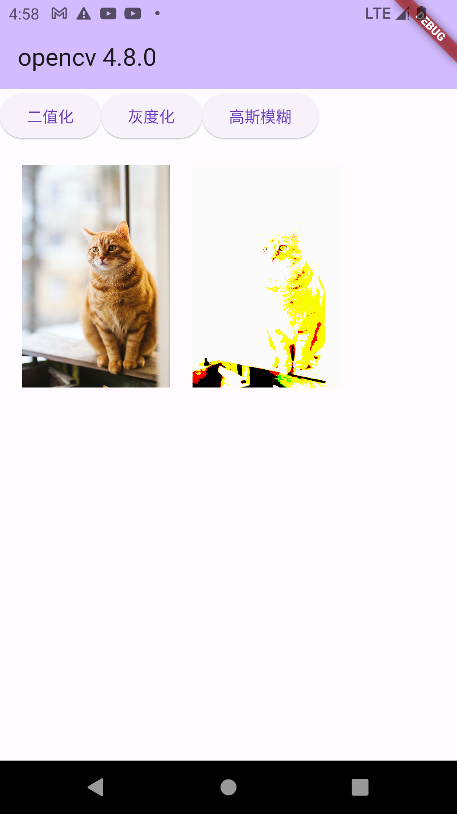

# flutter_opencv

```agsl
Framework • revision 796c8ef792 (7 weeks ago) • 2023-06-13 15:51:02 -0700
Engine • revision 45f6e00911
Tools • Dart 3.0.5 • DevTools 2.23.1
```

## preview




## flutter opencv for Android

download [opencv](https://opencv.org/releases/) 
1. copy `OpenCV-android-sdk/sdk/native/jni/include` to `flutter_proj/android/app/src/main/cpp/include`
2. copy `OpenCV-android-sdk/sdk/native/libs` to `flutter_proj/android/app/src/main/jniLibs/libs`
3. create `flutter_proj/android/app/CmakeLists.txt`

```agsl
cmake_minimum_required(VERSION 3.22.1)

include_directories(${CMAKE_SOURCE_DIR}/src/main/cpp/include)

add_library(libopencv_java4 SHARED IMPORTED)
set_target_properties(libopencv_java4 PROPERTIES IMPORTED_LOCATION
        ${CMAKE_SOURCE_DIR}/src/main/jniLibs/libs/${ANDROID_ABI}/libopencv_java4.so)

add_library( # Sets the name of the library.
        native-lib             # Sets the library as a shared library.
        SHARED             # Provides a relative path to your source file(s).
        src/main/cpp/native-lib.cpp )

find_library( # Sets the name of the path variable.
        log-lib              # Specifies the name of the NDK library that
        # you want CMake to locate.
        log )

target_link_libraries( # Specifies the target library.
        native-lib libopencv_java4                       # Links the target library to the log library
        android
        # included in the NDK.
        ${log-lib} )
```

4. edit `flutter_proj/android/app/build.gradle`

```agsl
def localProperties = new Properties()
def localPropertiesFile = rootProject.file('local.properties')
if (localPropertiesFile.exists()) {
    localPropertiesFile.withReader('UTF-8') { reader ->
        localProperties.load(reader)
    }
}

def flutterRoot = localProperties.getProperty('flutter.sdk')
if (flutterRoot == null) {
    throw new GradleException("Flutter SDK not found. Define location with flutter.sdk in the local.properties file.")
}

def flutterVersionCode = localProperties.getProperty('flutter.versionCode')
if (flutterVersionCode == null) {
    flutterVersionCode = '1'
}

def flutterVersionName = localProperties.getProperty('flutter.versionName')
if (flutterVersionName == null) {
    flutterVersionName = '1.0'
}

apply plugin: 'com.android.application'
apply plugin: 'kotlin-android'
apply from: "$flutterRoot/packages/flutter_tools/gradle/flutter.gradle"

android {
    namespace "com.example.flutter_opencv"
    compileSdkVersion 33//flutter.compileSdkVersion
    ndkVersion flutter.ndkVersion

    compileOptions {
        sourceCompatibility JavaVersion.VERSION_1_8
        targetCompatibility JavaVersion.VERSION_1_8
    }

    kotlinOptions {
        jvmTarget = '1.8'
    }

    sourceSets {
        main.java.srcDirs += 'src/main/kotlin'
    }

    defaultConfig {
        // TODO: Specify your own unique Application ID (https://developer.android.com/studio/build/application-id.html).
        applicationId "com.example.flutter_opencv"
        // You can update the following values to match your application needs.
        // For more information, see: https://docs.flutter.dev/deployment/android#reviewing-the-gradle-build-configuration.
        minSdkVersion 24//flutter.minSdkVersion
        targetSdkVersion 33//flutter.targetSdkVersion
        versionCode flutterVersionCode.toInteger()
        versionName flutterVersionName


        // 引入 c++_shared.so 库
        externalNativeBuild {
            cmake {
                cppFlags ""
                arguments "-DANDROID_STL=c++_shared"
            }
        }

    }

    // 配置 CmakeLists.txt 路径
    externalNativeBuild {
        cmake {
            path file('CMakeLists.txt')
            version '3.22.1'
        }
    }

    buildTypes {
        release {
            // TODO: Add your own signing config for the release build.
            // Signing with the debug keys for now, so `flutter run --release` works.
            signingConfig signingConfigs.debug
        }
    }
}

flutter {
    source '../..'
}

dependencies {
    implementation "org.jetbrains.kotlin:kotlin-stdlib-jdk7:$kotlin_version"
}

```

5. create `flutter_proj/android/app/src/main/cpp/native-lib.cpp`

```c
#include <jni.h>
#include <string>

#include<iostream>
#include <vector>
#include<opencv2/opencv.hpp>
#include <opencv2/imgproc/types_c.h>
//#include <opencv2/highgui/highgui.hpp>
//#include <opencv2/core/core.hpp>
//#include <opencv2/imgproc/imgproc.hpp>
#include <unistd.h>
#include <android/bitmap.h>

#include <android/log.h>
#define TAG "NATIVE" // 这个是自定义的LOG的标识
#define LOGD(...) __android_log_print(ANDROID_LOG_DEBUG,TAG ,__VA_ARGS__) // 定义LOGD类型
#define LOGI(...) __android_log_print(ANDROID_LOG_INFO,TAG ,__VA_ARGS__) // 定义LOGI类型
#define LOGW(...) __android_log_print(ANDROID_LOG_WARN,TAG ,__VA_ARGS__) // 定义LOGW类型
#define LOGE(...) __android_log_print(ANDROID_LOG_ERROR,TAG ,__VA_ARGS__) // 定义LOGE类型
#define LOGF(...) __android_log_print(ANDROID_LOG_FATAL,TAG ,__VA_ARGS__) // 定义LOGF类型
//char * name = "mronion";
//LOGD("my name is %s\n", name );

using namespace cv;
using namespace std;

const bool DEBUG_NATIVE = true;


#define ATTRIBUTES extern "C" __attribute__((visibility("default"))) __attribute__((used))


// opencv version
ATTRIBUTES char * opencv_version() {
    char * ver = CV_VERSION;
    if (DEBUG_NATIVE) {
        LOGD("opencv_version()  resulting version:%s\n", ver );
        //__android_log_print(ANDROID_LOG_VERBOSE, "NATIVE", "opencv_version()  resulting version %s\n", CV_VERSION);
    }
    return ver;
}

// decode 图片
ATTRIBUTES Mat *opencv_decodeImage(
        unsigned char *img,
        int32_t *imgLengthBytes) {

    Mat *src = new Mat();
    std::vector<unsigned char> m;

    __android_log_print(ANDROID_LOG_VERBOSE, "NATIVE",
                        "opencv_decodeImage() ---  start imgLengthBytes:%d ",
                        *imgLengthBytes);

    for (int32_t a = *imgLengthBytes; a >= 0; a--) m.push_back(*(img++));

    *src = imdecode(m, cv::IMREAD_COLOR);
    if (src->data == nullptr)
        return nullptr;

    if (DEBUG_NATIVE)
        __android_log_print(ANDROID_LOG_VERBOSE, "NATIVE",
                            "opencv_decodeImage() ---  len before:%d  len after:%d  width:%d  height:%d",
                            *imgLengthBytes, src->step[0] * src->rows,
                            src->cols, src->rows);

    *imgLengthBytes = src->step[0] * src->rows;
    return src;
}


//高斯模糊
ATTRIBUTES unsigned char *opencv_blur(
        uint8_t *imgMat,
        int32_t *imgLengthBytes,
        int32_t kernelSize) {
    // 1. decode 图片
    Mat *src = opencv_decodeImage(imgMat, imgLengthBytes);
    if (src == nullptr || src->data == nullptr)
        return nullptr;
    if (DEBUG_NATIVE) {
        __android_log_print(ANDROID_LOG_VERBOSE, "NATIVE",
                            "opencv_blur() ---  width:%d   height:%d",
                            src->cols, src->rows);

        __android_log_print(ANDROID_LOG_VERBOSE, "NATIVE",
                            "opencv_blur() ---  len:%d ",
                            src->step[0] * src->rows);
    }

    // 2. 高斯模糊
    //GaussianBlur(*src, *src, Size(151, 151), 151, 0, 4);
    GaussianBlur(*src, *src, Size(kernelSize, kernelSize), 15, 0, 4);
    std::vector<uchar> buf(1); // imencode() will resize it
//    Encoding with b       mp : 20-40ms
//    Encoding with jpg : 50-70 ms
//    Encoding with png: 200-250ms
    // 3. encode 图片
    imencode(".png", *src, buf);

    if (DEBUG_NATIVE) {
        __android_log_print(ANDROID_LOG_VERBOSE, "NATIVE",
                            "opencv_blur()  resulting image  length:%d %d x %d", buf.size(),
                            src->cols, src->rows);
    }

    *imgLengthBytes = buf.size();

    // the return value may be freed by GC before dart receive it??
    // Sometimes in Dart, ImgProc.computeSync() receives all zeros while here buf.data() is filled correctly
    // Returning a new allocated memory.
    // Note: remember to free() the Pointer<> in Dart!

    // 3. 返回data
    return buf.data();
}


// 灰度值
ATTRIBUTES unsigned char *opencv_gray(
        uint8_t *imgMat,
        int32_t *imgLengthBytes,
        int32_t kernelSize) {
    // 1. decode 图片
    Mat *src = opencv_decodeImage(imgMat, imgLengthBytes);
    if (src == nullptr || src->data == nullptr)
        return nullptr;
    if (DEBUG_NATIVE) {
        __android_log_print(ANDROID_LOG_VERBOSE, "NATIVE",
                            "opencv_gray() ---  width:%d   height:%d",
                            src->cols, src->rows);

        __android_log_print(ANDROID_LOG_VERBOSE, "NATIVE",
                            "opencv_gray() ---  len:%d ",
                            src->step[0] * src->rows);
    }

    // 2. 灰度值
    cvtColor(*src, *src, CV_BGRA2GRAY);
    cvtColor(*src, *src, CV_GRAY2BGRA);

    std::vector<uchar> buf(1); // imencode() will resize it
//    Encoding with b       mp : 20-40ms
//    Encoding with jpg : 50-70 ms
//    Encoding with png: 200-250ms
    // 3. encode 图片
    imencode(".png", *src, buf);

    if (DEBUG_NATIVE) {
        __android_log_print(ANDROID_LOG_VERBOSE, "NATIVE",
                            "opencv_gray()  resulting image  length:%d %d x %d", buf.size(),
                            src->cols, src->rows);
    }

    *imgLengthBytes = buf.size();

    // the return value may be freed by GC before dart receive it??
    // Sometimes in Dart, ImgProc.computeSync() receives all zeros while here buf.data() is filled correctly
    // Returning a new allocated memory.
    // Note: remember to free() the Pointer<> in Dart!

    // 3. 返回data
    return buf.data();
}


// 二值化
ATTRIBUTES unsigned char *opencv_threshold(
        uint8_t *imgMat,
        int32_t *imgLengthBytes,
        int32_t kernelSize) {
    // 1. decode 图片
    Mat *src = opencv_decodeImage(imgMat, imgLengthBytes);
    if (src == nullptr || src->data == nullptr)
        return nullptr;
    if (DEBUG_NATIVE) {
        __android_log_print(ANDROID_LOG_VERBOSE, "NATIVE",
                            "opencv_threshold() ---  width:%d   height:%d",
                            src->cols, src->rows);

        __android_log_print(ANDROID_LOG_VERBOSE, "NATIVE",
                            "opencv_threshold() ---  len:%d ",
                            src->step[0] * src->rows);
    }

    // 2. 进行二值化处理，选择30，200.0为阈值
    //threshold(*src, *src, 30, 200.0, CV_THRESH_BINARY);
    threshold(*src, *src, 30, kernelSize, CV_THRESH_BINARY);

    std::vector<uchar> buf(1); // imencode() will resize it
//    Encoding with b       mp : 20-40ms
//    Encoding with jpg : 50-70 ms
//    Encoding with png: 200-250ms
    // 3. encode 图片
    imencode(".png", *src, buf);

    if (DEBUG_NATIVE) {
        __android_log_print(ANDROID_LOG_VERBOSE, "NATIVE",
                            "opencv_threshold()  resulting image  length:%d %d x %d", buf.size(),
                            src->cols, src->rows);
    }

    *imgLengthBytes = buf.size();

    // the return value may be freed by GC before dart receive it??
    // Sometimes in Dart, ImgProc.computeSync() receives all zeros while here buf.data() is filled correctly
    // Returning a new allocated memory.
    // Note: remember to free() the Pointer<> in Dart!

    // 3. 返回data
    return buf.data();
}


```

main.dart 

```agsl
import 'dart:ffi';
import 'dart:io';
import 'dart:typed_data';

import 'package:ffi/ffi.dart';
import 'package:flutter/material.dart';
import 'package:flutter/services.dart';
import 'package:image_picker/image_picker.dart';

void main() {
  runApp(const MyApp());
}

class MyApp extends StatelessWidget {
  const MyApp({super.key});

  // This widget is the root of your application.
  @override
  Widget build(BuildContext context) {
    return MaterialApp(
      title: 'Flutter Demo',
      theme: ThemeData(
        colorScheme: ColorScheme.fromSeed(seedColor: Colors.deepPurple),
        useMaterial3: true,
      ),
      home: const MyHomePage(),
    );
  }
}

class MyHomePage extends StatefulWidget {
  const MyHomePage({super.key});

  @override
  State<MyHomePage> createState() => _MyHomePageState();
}

class _MyHomePageState extends State<MyHomePage> {

  final _picker = ImagePicker();

  String? _opencvVersion;
  Uint8List? _srcImageBytes;
  Uint8List? _dstImageBytes;


  initData() async{
    /// 读取图片，转换成 Uint8List
    final bytes = await rootBundle.load('assets/imgs/1.jpg');
    _srcImageBytes = bytes.buffer.asUint8List();
    _opencvVersion = await version();
    setState(() {});
  }

  @override
  void initState() {
    super.initState();

    initData();
  }


  @override
  Widget build(BuildContext context) {

    return Scaffold(
      appBar: AppBar(
        backgroundColor: Theme.of(context).colorScheme.inversePrimary,
        title: Text("opencv ${_opencvVersion}"),
      ),
      body: SingleChildScrollView(

        child: Column(
          mainAxisAlignment: MainAxisAlignment.center,
          children: <Widget>[
            Container(
              child: Row(
                children: [
                  ElevatedButton(onPressed: () async {
                    final tmp  = await threshold(_srcImageBytes!);
                    if(tmp !=null){
                      _dstImageBytes = tmp;
                    }
                    setState(() {

                    });
                  }, child: Text("二值化")),
                  ElevatedButton(onPressed: () async {
                    final tmp  = await gray(_srcImageBytes!);
                    if(tmp !=null){
                      _dstImageBytes = tmp;
                    }
                    setState(() {

                    });
                  }, child: Text("灰度化")),
                  ElevatedButton(onPressed: () async {
                    final tmp  = await blur(_srcImageBytes!);
                    if(tmp !=null){
                      _dstImageBytes = tmp;
                    }
                    setState(() {

                    });
                  }, child: Text("高斯模糊")),
                ],
              ),
            ),


            Container(
              //height: 250,
                padding: EdgeInsets.all(20),
                child: Row(
                  children: [
                    GestureDetector(
                      onTap: () async {
                        await _pickImageFromGallery();
                      },
                      child:  Container(
                        height: 200,
                        child:
                        _srcImageBytes!=null? Image.memory(_srcImageBytes!):Container(),
                      )
                    ),

                    SizedBox(width: 20,),

                    (_dstImageBytes != null) ?
                    Container(
                        height: 200,
                        child:
                        Image.memory(_dstImageBytes!)
                    )
                    :Container(),


                  ],
                )
            ),


          ],
        ),
      ),
    );
  }


  ///
  /// 从相册选择图片
  ///
  Future<void> _pickImageFromGallery() async {
    final pickedFile = await _picker.pickImage(source: ImageSource.gallery);
    if (pickedFile != null) {
      //setState(() => this._imageFile = File(pickedFile.path));
      File _file = File(pickedFile.path);
      //_srcImg = Image.file(_file!);
      //_dstImg = Image.file(_file!);
      _srcImageBytes = _file.readAsBytesSync();

      setState(() {});
    }
  }


}


///version
Future<String?> version() async{

  // 查找 C++ 中的 opencv_blur() 函数
  final DynamicLibrary _opencvLib =
  Platform.isAndroid ? DynamicLibrary.open("libnative-lib.so") : DynamicLibrary.process();
  final Pointer<Int8> Function() opencv_version =
  _opencvLib
      .lookup<
      NativeFunction<
          Pointer<Int8> Function()>>("opencv_version")
      .asFunction();

  Pointer<Int8> _version = opencv_version();
  final ret =  _version.cast<Utf8>().toDartString();
  print("open ver:$ret");

  return ret;
}


/// 高斯模糊
Future<Uint8List?> blur(Uint8List list) async {
  /// 深拷贝图片
  Pointer<Uint8> bytes = malloc.allocate<Uint8>(list.length);
  for (int i = 0; i < list.length; i++) {
    bytes.elementAt(i).value = list[i];
  }
  // 为图片长度分配内存
  final imgLengthBytes = malloc.allocate<Int32>(1)..value = list.length;

  // 查找 C++ 中的 opencv_blur() 函数
  final DynamicLibrary _opencvLib =
  Platform.isAndroid ? DynamicLibrary.open("libnative-lib.so") : DynamicLibrary.process();
  final Pointer<Uint8> Function(
      Pointer<Uint8> bytes, Pointer<Int32> imgLengthBytes, int kernelSize) blur =
  _opencvLib
      .lookup<
      NativeFunction<
          Pointer<Uint8> Function(Pointer<Uint8> bytes, Pointer<Int32> imgLengthBytes,
              Int32 kernelSize)>>("opencv_blur")
      .asFunction();

  /// 调用高斯模糊
  final newBytes = blur(bytes, imgLengthBytes, 251);
  if (newBytes == nullptr) {
    print('高斯模糊失败');
    return null;
  }

  var newList = newBytes.asTypedList(imgLengthBytes.value);

  /// 释放指针
  malloc.free(bytes);
  malloc.free(imgLengthBytes);
  return newList;
}


/// 灰度值
Future<Uint8List?> gray(Uint8List list) async {
  /// 深拷贝图片
  Pointer<Uint8> bytes = malloc.allocate<Uint8>(list.length);
  for (int i = 0; i < list.length; i++) {
    bytes.elementAt(i).value = list[i];
  }
  // 为图片长度分配内存
  final imgLengthBytes = malloc.allocate<Int32>(1)..value = list.length;

  // 查找 C++ 中的 opencv_blur() 函数
  final DynamicLibrary _opencvLib =
  Platform.isAndroid ? DynamicLibrary.open("libnative-lib.so") : DynamicLibrary.process();
  final Pointer<Uint8> Function(
      Pointer<Uint8> bytes, Pointer<Int32> imgLengthBytes, int kernelSize) opencv_gray =
  _opencvLib
      .lookup<
      NativeFunction<
          Pointer<Uint8> Function(Pointer<Uint8> bytes, Pointer<Int32> imgLengthBytes,
              Int32 kernelSize)>>("opencv_gray")
      .asFunction();

  /// 调用灰度值
  final newBytes = opencv_gray(bytes, imgLengthBytes, 251);
  if (newBytes == nullptr) {
    print('灰度值失败');
    return null;
  }

  var newList = newBytes.asTypedList(imgLengthBytes.value);

  /// 释放指针
  malloc.free(bytes);
  malloc.free(imgLengthBytes);
  return newList;
}


/// 二值化
Future<Uint8List?> threshold(Uint8List list) async {
  /// 深拷贝图片
  Pointer<Uint8> bytes = malloc.allocate<Uint8>(list.length);
  for (int i = 0; i < list.length; i++) {
    bytes.elementAt(i).value = list[i];
  }
  // 为图片长度分配内存
  final imgLengthBytes = malloc.allocate<Int32>(1)..value = list.length;

  // 查找 C++ 中的 opencv_blur() 函数
  final DynamicLibrary _opencvLib =
  Platform.isAndroid ? DynamicLibrary.open("libnative-lib.so") : DynamicLibrary.process();
  final Pointer<Uint8> Function(
      Pointer<Uint8> bytes, Pointer<Int32> imgLengthBytes, int kernelSize) opencv_threshold =
  _opencvLib
      .lookup<
      NativeFunction<
          Pointer<Uint8> Function(Pointer<Uint8> bytes, Pointer<Int32> imgLengthBytes,
              Int32 kernelSize)>>("opencv_threshold")
      .asFunction();

  /// 调用二值化
  final newBytes = opencv_threshold(bytes, imgLengthBytes, 251);
  if (newBytes == nullptr) {
    print('二值化失败');
    return null;
  }

  var newList = newBytes.asTypedList(imgLengthBytes.value);
  print("zzz");

  /// 释放指针
  malloc.free(bytes);
  malloc.free(imgLengthBytes);
  return newList;
}
```